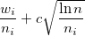
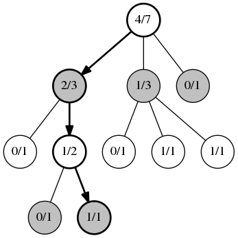
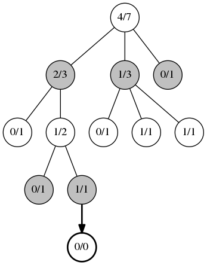
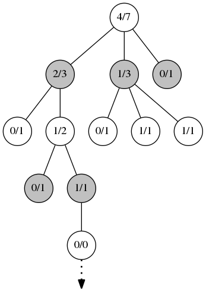
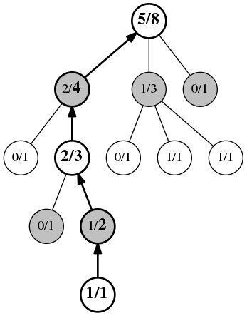

### Структура алгоритма ConnectX
### Сеть CNN
Алгоритм ConnectX в целом можно разделить на две части: дерево поиска Монте-Карло и сверточную нейронную сеть CNN. 
В этом эксперименте сверточная нейронная сеть использует относительно простую структуру, которая специально 
реализована как четырехслойный сверточный слой с четырьмя полностью связанными слоями, из которых два последних 
полностью связанных слоя сопоставляются с функциями активации для вывода вероятностей действий π(s,а) и ценность v(s).

против v(s). в π(s,а) Представляет вероятность выполнения различных действий для текущего 
состояния,v(s) против) v ( s ) Представляет значение состояния, vА[-1,1], 1 означает абсолютную победу, -1 означает 
абсолютное поражение.

### MCTS

Поиск по дереву методом Монте-Карло (MCTS) - это метод для принятия наилучшего решения в задачах искусственного 
интеллекта, который сочетает в себе универсальность стохастического моделирования и точность поиска по дереву. MCTS 
добился большого успеха в решении проблемы Go, но его область применения не ограничивается играми. Так же, стоит 
отметить, что метод Монте-Карло используется в нашумевшей программе AlphaGo, победившей го-профессионала 9-го дана 
Ли Седоля в серии из 5 игр.  Теоретически его также можно применить к любой области, где описывается {состояние, 
действие} и для прогнозирования результата используется моделирование.

Версия алгоритма Монте-Карло под названием Upper Confidence bound applied to Trees (UCT). Основой алгоритма UCT 
является решение задачи многоруких бандитов. В частности используется алгоритм Upper-Confidence-Bound (UCB).  На 
практике для поиска в дереве ходов настольных игр часто используется модификация формулы UCB. 

здесь  Wi - это количество побед i-го узла. Ni — количество посещений i-го узла, а  N - количество посещений всех 
соседних узлов. C - это константа, используемая для установки нужного баланса между шириной и глубиной поиска. Чем она 
больше, тем более глубокий будет поиск.  

Как видно из названия, алгоритм UCT (Upper Confidence bound applied to 
Trees) использует подход UCB для поиска по дереву. Рассмотрим пошагово каждую фазу алгоритма: 

Первая фаза, выбор. Каждую позицию мы рассматриваем как задачу многорукого бандита. Узлы на каждом этапе выбираются 
согласно алгоритму UCB. Эта фаза действует до тех пор, пока не будет найден узел в котором еще не все дочерние узлы 
имеют статистику побед. На рисунке первое значение в узле это количество побед, второе общее количество игр в этом 
узле.   
 

Вторая фаза, расширение. Когда алгоритм UCB больше не может быть применим, добавляется новый дочерний узел.

Третья фаза, симуляция. Из созданного на предыдущем этапе узла запускается игра со случайными или, в случае 
использования эвристик, не совсем случайными ходами. Игра идет до конца партии. Здесь важна только информация о 
победителе, оценка позиции не имеет значения.  

Четвертая фаза, обратное распространение. На этом этапе информация о сыгранной партии распространяется вверх по 
дереву, обновляя информацию в каждом из ранее пройденных узлов. Каждый из этих узлов увеличивает показатель 
количества игр, а узлы, совпадающие с победителем, увеличивают также и количество побед. В конце алгоритма 
выбирается узел, посещенный наибольшее количество раз.   

UCT не всегда выбирает только самый лучший ход, но так же периодически исследует и менее успешные узлы. Второй 
параметр формулы медленно растет для тех узлов, которые посещаются не так часто. И в итоге на каком-то этапе 
алгоритм выберет именно такой ход в качестве предпочтительного. Если ход оправдал ожидания, в следующий раз он будет 
выбран с большей вероятностью.   

По сравнению с другими алгоритмами для поиска оптимальных ходов, UCT обладает следующими преимуществами:

- UCT может быть безболезненно остановлен на любом этапе работы. И на момент остановки он просчитает равномерно все 
варианты ходов из корневого узла 

- Дерево растет асимметрично, исследуя предпочтительные ходы глубже остальных. Таким образом, достигается большая 
  эффективность в сравнении с другими алгоритмами в играх со значительным количеством вариантов для перебора. 

В MTCS каждый узел представляет состояние шахматной доски, а каждое направленное ребро представляет существование 
действия, которое может сделать узел. Передача состояния на узел j. Построение дерева Монте-Карло начинается с 
пустого дерева поиска, исследуя по одному узлу за раз. При обнаружении нового узла прогноз нейронной сети будет 
использоваться в качестве начального значения узла. Поиск дерева Монте-Карло на основе нейронной сети в основном 
состоит из следующих шагов:

1. начиная с корневого узла, каждый раз, когда выбирается дочерний узел, который стоит изучить. Выбор узла 
основан на верхней доверительной границе Q (верхняя доверительная граница на Q) до тех пор, пока не будет найден 
неисследованный. Дочерний узел. Верхний доверительный предел значения Q определяется как:

- Q(s,а): Ожидаемое вознаграждение за выполнение действия 'a' в состоянии 's'. Начальное значение Q(s,а) = 0;
- N(s,а): Количество раз, когда действие 'a' было выполнено в состоянии 's';
- P (s, ·): Вероятность действия в состоянии 's', значение стратегии, предсказанное нейронной сетью;
- {puct} : Гиперпараметры, контролируйте степень исследования.

2. если текущий дочерний узел не является конечным узлом (то есть он не завершит игру) и не был исследован, то 
вероятность и значение стратегии, предсказанные CNN, будут использоваться в качестве начальной информации об узле.
   

3. Моделирование: в классическом алгоритме MCTS используется классическая стратегия, такая как стратегия развертывания, 
   для перехода к нижней части дерева и последующего возврата после получения результата. Но в MCTS на основе 
   нейронной сети расширение узла не обязательно должно идти вниз по дереву, нам нужно только изменить новое 
   состояние - s′. Все соответствующие возможные действия инициализируются, а информация об их узлах Q(s′,а) и N(s′,
   а) равно 0. 
   

4. Обратное распространение: если вновь развернутый узел не является конечным узлом, то соответствующий v(s′)  
   Вернитесь к верхнему узлу и обновите все Q(s,а) и N(s,а). Если вновь 
   развернутый узел является конечным узлом, реальное значение вознаграждения в игре прослеживается до верхнего узла.
   Среди них реальное вознаграждение составляет -1, 1 или 0,0001.  

### Обработка данных

Агент: игроки, участвующие в шахматных партиях;
Среда: общая среда шахматной доски;
Статус: поверхность шахматной доски;
Действие: игрок может выбрать позицию выстрела. Поскольку выстрелы в игре будут падать из-за силы тяжести, 
выбираемые позиции выстрелов - это неполные столбцы. Например, когда игровая доска инициализирована, выбираемая 
позиция шага равна 7;  
Награда: 0 означает, что игра не окончена, 1 означает победу, -1 означает поражение, 0,0001 означает ничью.

В этом эксперименте мы используем набор данных refmoves1k_kaggle в качестве набора данных оценки модели. Этот набор 
данных представляет собой набор данных самопроверки, созданный Питером Кнудде для конкурса Connect X на платформе 
Kaggle. Набор данных содержит 1000 записей доски, каждый из которых представляет собой соответствующий счет и 
соответствующий счет за ход в каждом столбце под доской. В качестве примера возьмем фрагмент данных:   

{"доска": [0, 0, 0, 0, 0, 0, 0, 0, 0, 2, 0, 0, 0, 2, 0, 0, 2, 0, 0, 0, 1, 0, 0, 1, 0, 0, 0, 2, 1, 0, 2, 0, 0, 0, 1, 
1, 1, 2, 1, 0, 1, 2], «счет»: -2, «ход оценка ": [-3, -4, -4, -2, -6, -5, -4]} 

- board: Шахматная поверхность, хранящаяся в виде одномерного массива;
- score: Лучший результат на текущей доске;
- move score: Одномерный массив, содержащий семь значений, каждое значение представляет счет шахматной фигуры, 
помещенной в этот столбец. Конкретное значение счета: 

- Score = 0: Игра будет вничью;
- Score > 0: Теперь игрок, держащий шахматы, выиграет, чем выше значение очков, тем быстрее будет победа. В игре у 
  каждого игрока есть 21 фигура, если score = +5, то это означает, что игрок (21 - 5) * 2 = 32определит победу на  
  первом шахматном ходу;
- Score < 0: Теперь игрок, держащий шахматы, проиграет игру.Чем больше абсолютное значение счета, тем быстрее игра 
  будет проиграна;
- Score = -99： Это означает, что на данной позиции нельзя играть в шахматы.
Приведите более наглядный пример:

{"доска": [0, 0, 0, 0, 0, 0, 0, 0, 0, 0, 0, 0, 0, 0, 0, 0, 0, 1, 0, 0, 0, 0, 0, 2, 2, 0, 0, 0, 0, 0, 2, 1, 0, 0, 0, 
 0, 1, 2, 1, 1, 2, 0], «счет»: 0, «счет хода ": [-16, -16, 0, -16, -16, -16, -16]}

### Дизайн агента
модель используется→ Алгоритм→Агент конструирует агента:

Модель: 
Модель используется для определения прямой сети. В этом эксперименте прямая сеть состоит из 
четырех сверточных слоев и четырех полностью связанных слоев. Последние два полностью связанных слоя объединены с 
функциями активации для вывода вероятностей стратегии соответственно. Число π(s,а). И ценность v(s)

Алгоритм: 
алгоритм определяет конкретный алгоритм обновления прямой сети (модели), то есть обновления модели путем 
определения функции потерь. Вычисления, относящиеся к алгоритмам, могут быть определены в алгоритме. 

Агент: 
Агент отвечает за взаимодействие между алгоритмом и средой и предоставляет сгенерированные данные алгоритму 
для обновления модели во время взаимодействия. 

### Поиск дерева Монте-Карло на основе нейронной сети
Для каждого узла в дереве Монте-Карло он содержит следующие переменные:

- Qsa: Ожидаемая награда за выполнение действия в состоянии s;
- Nsa: Количество посещений этой позиции (s, a) в дереве поиска;
- Ns: Количество посещений состояния доски;
- Ps: Вероятность действия предсказывается нейронной сетью, то есть начальное значение вероятности политики;
- Es: Состояние игры, соответствующее состоянию доски s, выигрыш, проигрыш, ничья или игра не окончена;
- Vs: Возможное действие, соответствующее состоянию платы s
В [ ]
EPS = 1e-8

Актер эквивалентен игроку в игре, и его основные функции заключаются в следующем:

- self_play: Используйте MCTS для самостоятельной игры и сбора данных;
- pitting: MCTS, построенная нейронной сетью предыдущего поколения, противопоставляется MCTS, построенной нейронной 
  сетью нового поколения, и недавно обученная модель нейронной сети принимается, когда определяется окончательная 
  победа;
- evaluate_test_dataset: Используйте данные refmoves1k_kaggle для оценки модели, индикаторы оценки - Perfect Move и 
   Good Move. Среди них Perfect Move означает, что агент выбрал действие, которое увеличивает количество очков, а 
   Good Move означает, что агент выбрал тот же тип действия, что и идеальный ход. Хотя это не оптимальное действие, 
   оно все же относится к категории того же типа, что и идеальный ход. Например, он также может принести игроку 
   победу, поражение или ничью;
- _executeEpisode: Выполнить эпизод до конца игры.

### Каждый раунд обучения разделен на четыре этапа:

1. самостоятельная игра: самостоятельная игра, увеличение количества данных;
2. узнать: обучающая нейронная сеть;
3. оценить_test_dataset: оценить недавно обученную сеть;
4. Питтинг: старая сеть борется с новой сетью и решает, следует ли использовать новую обученную сеть, в соответствии с 
   коэффициентом выигрыша.

поскольку модель будет сохраняться, обучаться и оцениваться один раз для каждой итерации, они вызываются шаг за 
шагом через класс Coach.